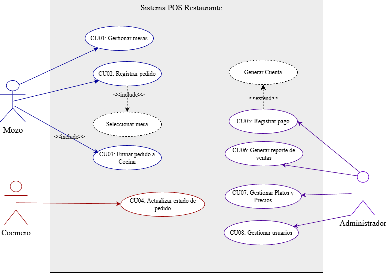

## Diagrama de casos de uso

# Casos de Uso – Sistema POS Restaurante
---

## Diagrama de Casos de Uso

> **Diagrama general del sistema POS Restaurante**

---

## Documentación de Casos de Uso

### CU01 – Gestionar Mesas
**Actor principal:** Mozo  
**Objetivo:** Permitir al mozo ver, asignar o liberar mesas disponibles.  
**Precondiciones:** El usuario debe haber iniciado sesión con rol de mozo.  

**Flujo principal:**
1. El mozo selecciona “Gestionar Mesas”.
2. El sistema muestra el listado de mesas con su estado.
3. El mozo selecciona una mesa libre.
4. El sistema marca la mesa como “Ocupada” y la asocia al mozo.

**Reglas de negocio:**
- No se puede asignar una mesa ya ocupada.  
- Solo los usuarios con rol “Mozo” pueden ejecutar esta acción.  

**Postcondición:**  
La mesa queda registrada como ocupada en el sistema.

---

### CU02 – Registrar Pedido
**Actor principal:** Mozo  
**Objetivo:** Registrar los pedidos realizados por los clientes en una mesa.  
**Precondiciones:** La mesa debe estar asignada y el usuario autenticado.  

**Flujo principal:**
1. El mozo selecciona la mesa asignada.
2. El sistema muestra el menú disponible.
3. El mozo selecciona los platos y cantidades.
4. El sistema calcula el total preliminar.
5. El mozo confirma el pedido y lo envía a cocina.

**Reglas de negocio:**
- No se puede registrar un pedido sin mesa asignada.  
- Solo los mozos pueden crear pedidos.

**Postcondición:**  
El pedido queda registrado con estado “Pendiente”.

---

### CU03 – Enviar Pedido a Cocina
**Actor principal:** Mozo  
**Objetivo:** Enviar los pedidos confirmados a cocina para su preparación.  
**Precondiciones:** Debe existir un pedido confirmado.  

**Flujo principal:**
1. El mozo selecciona el pedido a enviar.
2. El sistema cambia su estado a “Enviado a cocina”.
3. La cocina recibe el detalle del pedido.

**Reglas de negocio:**
- No se puede enviar un pedido vacío.  
- Cada pedido debe tener al menos un ítem registrado.

**Postcondición:**  
El pedido pasa a la cola de cocina.

---

### CU04 – Actualizar Estado de Pedido
**Actor principal:** Cocinero  
**Objetivo:** Permitir que la cocina marque los pedidos como “En preparación” o “Listo para entregar”.  
**Precondiciones:** Debe existir un pedido enviado a cocina.  

**Flujo principal:**
1. El cocinero visualiza los pedidos pendientes.
2. Cambia el estado del pedido a “En preparación”.
3. Cuando finaliza, cambia el estado a “Listo para entrega”.
4. El sistema notifica al mozo.

**Reglas de negocio:**
- Solo el cocinero puede actualizar el estado.  
- Los estados válidos son “Pendiente”, “En preparación” y “Listo”.

**Postcondición:**  
El pedido queda disponible para ser entregado por el mozo.

---

### CU05 – Registrar Pago
**Actor principal:** Mozo  
**Objetivo:** Registrar el pago del pedido de una mesa con diferentes métodos.  
**Precondiciones:** El pedido debe estar marcado como “Listo para entrega”.  

**Flujo principal:**
1. El mozo selecciona la mesa y la cuenta asociada.
2. El sistema muestra el total a pagar.
3. El mozo selecciona el método de pago (efectivo, tarjeta, etc.).
4. El sistema registra el pago y emite el comprobante.

**Reglas de negocio:**
- No se puede registrar un pago sin pedido finalizado.  
- Solo los mozos o administradores pueden cerrar una cuenta.

**Postcondición:**  
El pedido queda cerrado y la mesa vuelve a estado “Libre”.

---

### CU06 – Generar Reporte de Ventas
**Actor principal:** Administrador  
**Objetivo:** Generar reportes diarios de ventas y control de caja.  
**Precondiciones:** Deben existir pedidos finalizados con pago registrado.  

**Flujo principal:**
1. El administrador selecciona “Generar Reporte”.
2. Define el rango de fechas o turno.
3. El sistema consolida los pedidos pagados.
4. Muestra los resultados en pantalla y permite exportar a PDF.

**Reglas de negocio:**
- Solo el administrador puede generar reportes.  
- Los datos del reporte deben coincidir con los pagos registrados.

**Postcondición:**  
Se genera un reporte disponible para impresión o descarga.

---

### CU07 – Gestionar Platos y Precios
**Actor principal:** Administrador  
**Objetivo:** Permitir al administrador agregar, editar o eliminar platos del menú.  
**Precondiciones:** El usuario debe tener rol de administrador.  

**Flujo principal:**
1. El administrador accede al módulo de gestión del menú.
2. Selecciona la opción agregar, editar o eliminar.
3. El sistema actualiza la información en la base de datos.

**Reglas de negocio:**
- No se pueden eliminar platos con pedidos activos.  
- Los precios deben ser valores positivos.

**Postcondición:**  
El menú se actualiza correctamente.

---

### CU08 – Gestionar Usuarios
**Actor principal:** Administrador  
**Objetivo:** Administrar los usuarios del sistema (mozos, cocineros, administradores).  
**Precondiciones:** El usuario debe tener rol de administrador.  

**Flujo principal:**
1. El administrador ingresa al módulo de usuarios.
2. Visualiza la lista de cuentas registradas.
3. Crea, edita o elimina un usuario.
4. El sistema guarda los cambios realizados.

**Reglas de negocio:**
- No se puede eliminar la cuenta del administrador principal.  
- Cada usuario debe tener un rol asignado.

**Postcondición:**  
La información de usuarios queda actualizada en el sistema.

