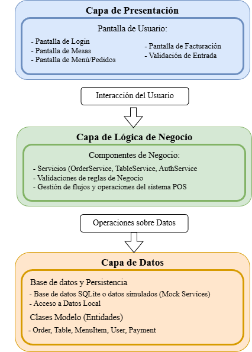

## Patrón de software

# Patrón de Software – Sistema POS Restaurante

## Esquema de la Arquitectura

> **Arquitectura en Capas con MVVM (Model–View–ViewModel)**

--- 

## Explicación del Patrón

El sistema **POS Restaurante**, desarrollado en **.NET MAUI**, aplica el **patrón de arquitectura en capas**, complementado con el patrón de diseño **MVVM (Model–View–ViewModel)**.  
Este patrón fue elegido porque permite estructurar el sistema de forma modular, separando la interfaz de usuario, la lógica de negocio y el acceso a datos, lo que facilita su mantenimiento, escalabilidad y comprensión.  
En la **Capa de Presentación**, las pantallas y *ViewModels* gestionan la interacción del usuario, permitiendo que mozos y cocina se comuniquen en tiempo real.  
La **Capa de Lógica de Negocio** concentra los servicios responsables de procesar pedidos, manejar el estado de las mesas y registrar pagos, garantizando la coherencia de las operaciones.  
Finalmente, la **Capa de Datos** contiene las entidades y el contexto de base de datos local mediante **SQLite**, encargado de almacenar información persistente del restaurante.  
Gracias a esta separación, cada capa puede evolucionar de manera independiente, permitiendo integrar futuras mejoras como control de stock o reservas sin afectar el funcionamiento actual del sistema.
