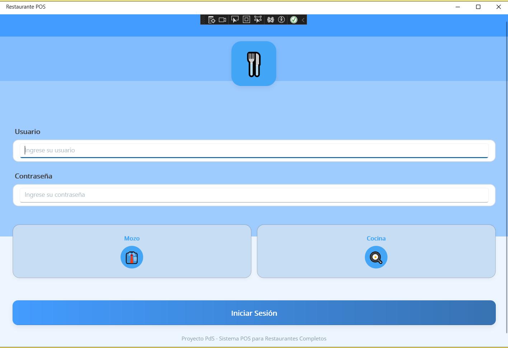
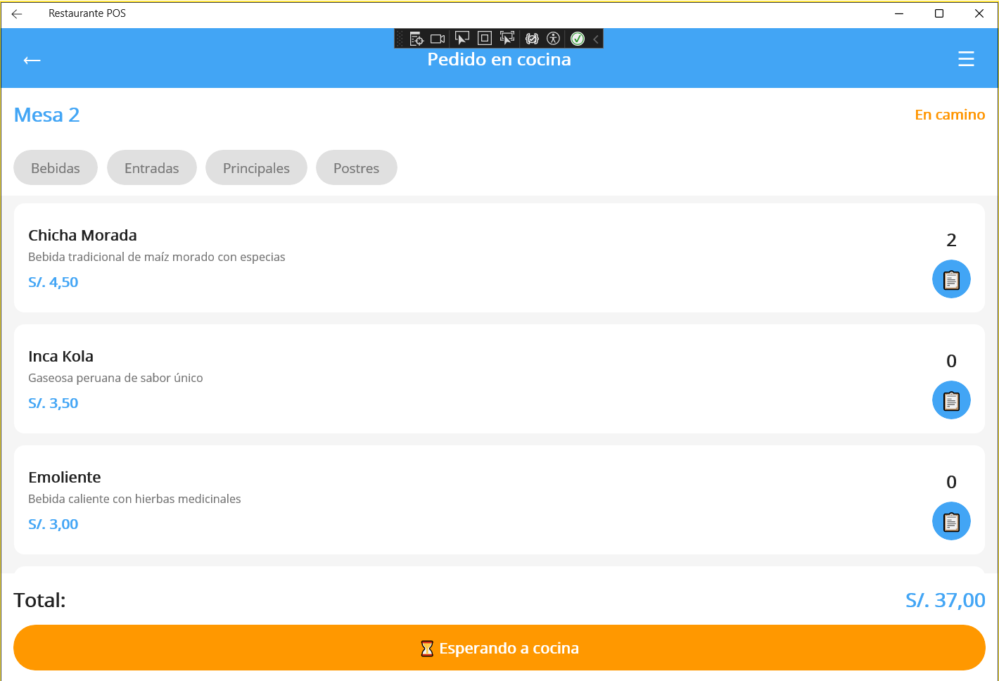
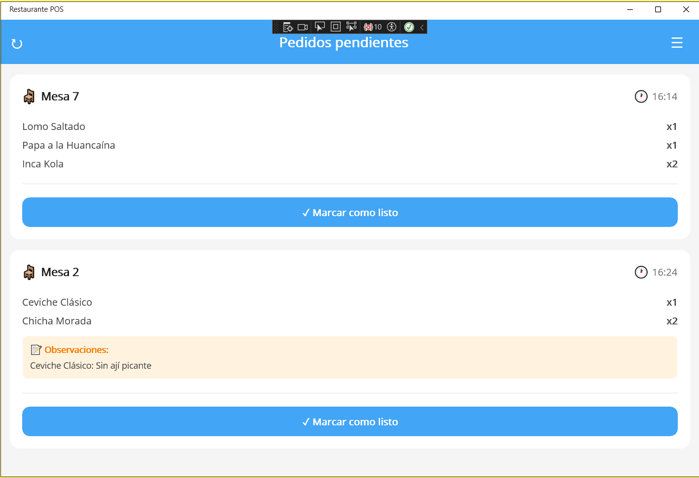

## 📱 Pantallas de Interfaz de Usuario – Sistema de Gestión para Restaurante

Este documento presenta las pantallas del prototipo del sistema de gestión para restaurante, organizadas según el tipo de usuario (Mozo y Cocina) y el flujo de funcionamiento del sistema.

## 🔐 1. Pantalla de Inicio de Sesión

Permite ingresar como Mozo o como Cocina.

Pantalla: 

## 👨‍💼 2. Interfaz del Usuario Mozo
🟩 2.1. Mapa de Mesas

El mozo visualiza todas las mesas y su estado:

🟢 Disponible

🔴 Ocupado

Pantalla:
.jpeg)

## 🍽️ 2.2. Mesa Disponible → Registrar Pedido

Al seleccionar una mesa disponible, se muestra la lista del menú.

Pantalla:
.jpeg)

## 🧾 2.3. Mesa Ocupada → Visualización del Pedido

Si la mesa tiene un pedido activo, el mozo puede ver los detalles.

Pantalla:

## 💵 2.4. Mesa Ocupada → Boleta

Cuando cocina marca el pedido como Listo, aparece la boleta de la mesa.

Pantalla:
.jpeg)

## 👨‍🍳 3. Interfaz del Usuario Cocina
## 📋 3.1. Lista de Pedidos

La cocina recibe los pedidos y puede marcarlos como Listo.

Pantalla:

