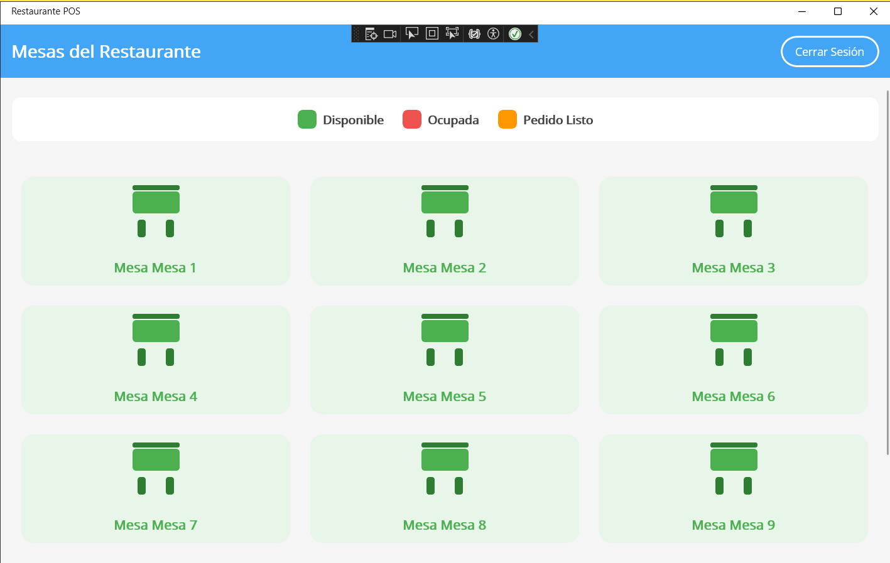
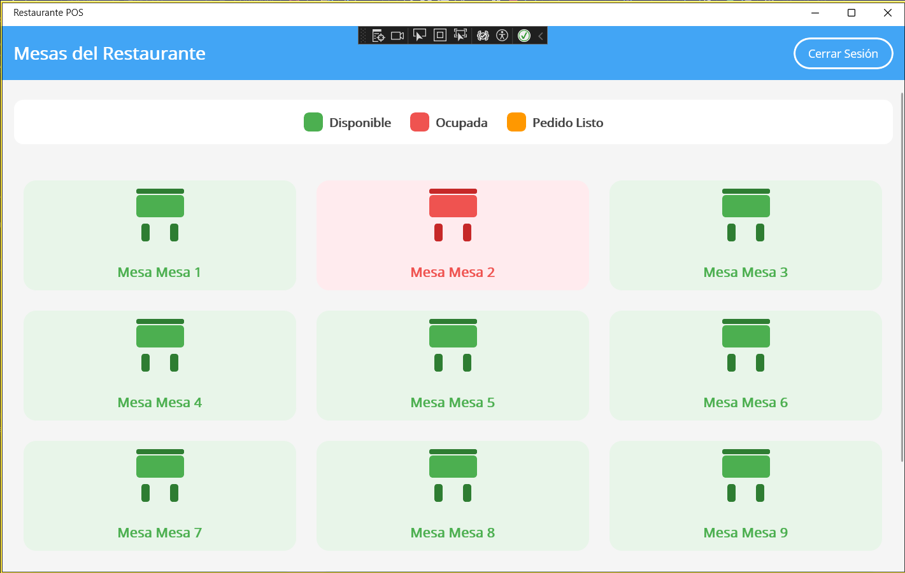
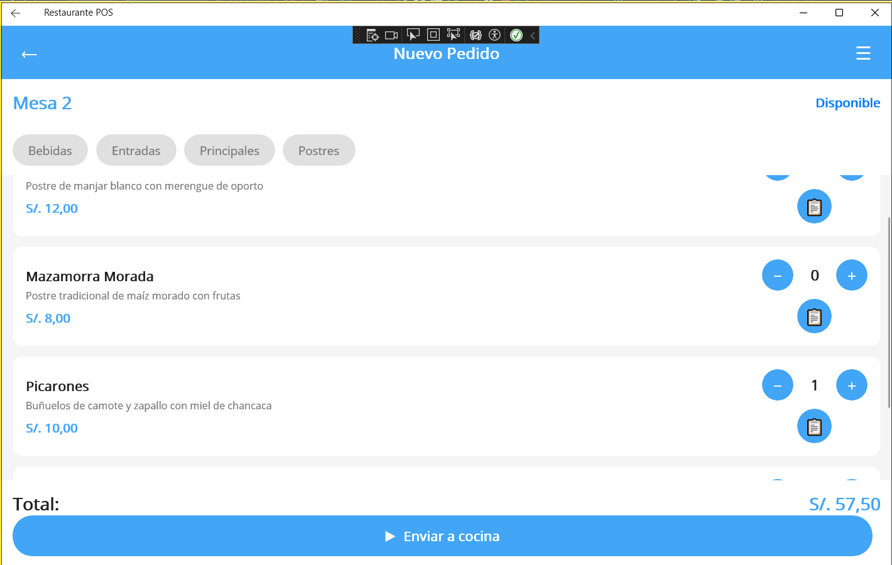
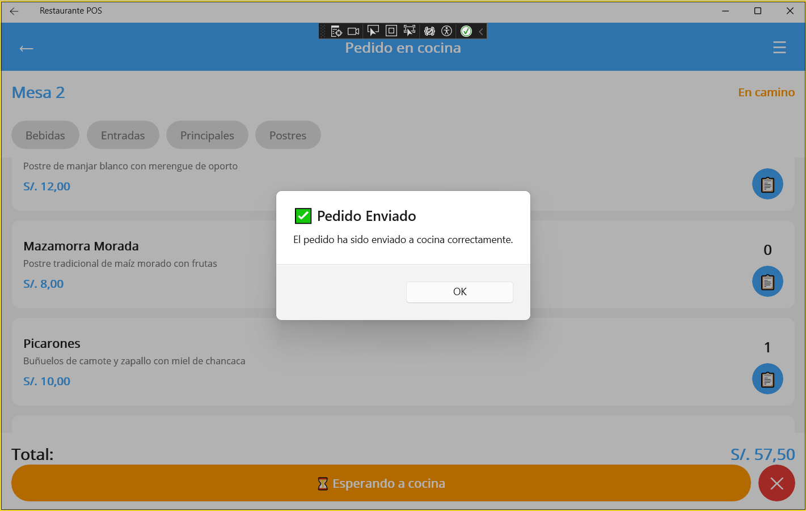
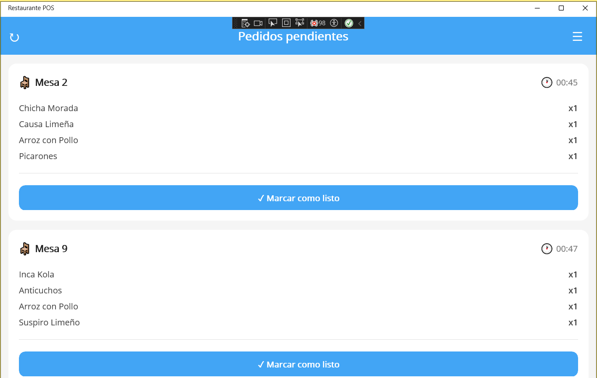
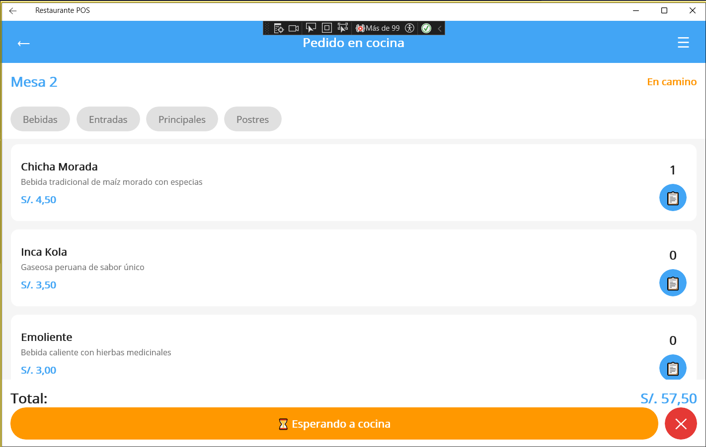
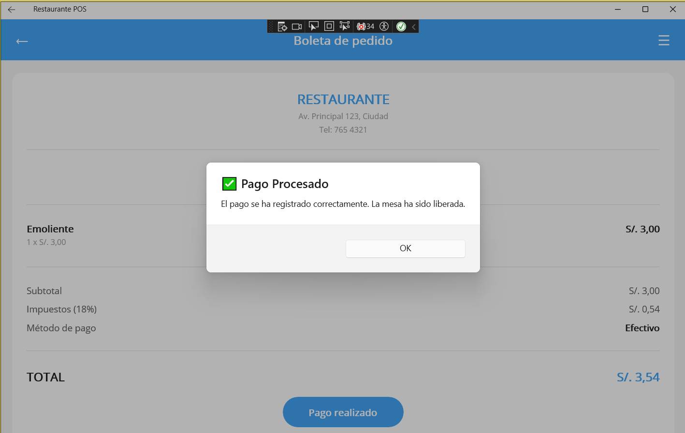
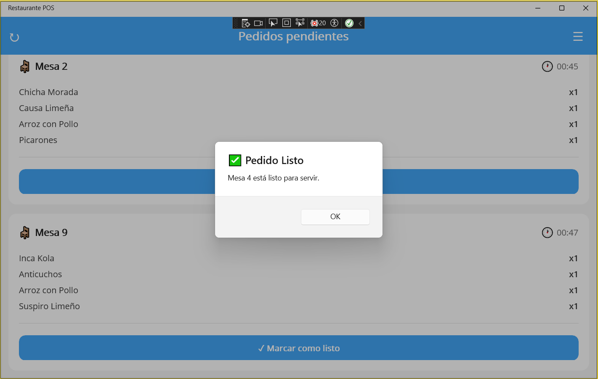

## Pruebas de caja negra

# Matriz de Trazabilidad de Pruebas – Caja Negra

| ID RF  | Descripción del Requisito | ID Prueba | Descripción de la Prueba | Resultado Esperado | Resultado Obtenido | Estado |
|--------|----------------------------|-----------|---------------------------|---------------------|---------------------|--------|
| RF-01  | Gestión de Mesas (Disponible/Ocupada) | CP-01 | Verificar cambio de estado de mesa | La mesa cambia correctamente entre Disponible y Ocupada | (VER IMAGEN DE ABAJO) | Aprobado / Reprobado |
| RF-02  | Toma y Envío de Pedidos | CP-02 | Registrar pedido desde mesa ocupada | El pedido se registra y se envía correctamente a cocina | (VER IMAGEN DE ABAJO) | Aprobado |
| RF-03  | Comunicación en Tiempo Real con Cocina | CP-03 | Verificar actualización automática en cocina | El pedido aparece en tiempo real sin refrescar | (VER IMAGEN DE ABAJO) | Aprobado |
| RF-04  | Estados del Pedido (Pendiente / Listo) | CP-04 | Cambiar estado del pedido en cocina | El estado cambia correctamente a “Listo para entregar” | (VER IMAGEN DE ABAJO) | Aprobado |
| RF-05  | Menú de Solo Lectura | CP-05 | Validar que el menú no sea editable | El menú es visible pero no editable | (VER IMAGEN DE ABAJO) | Aprobado |
| RF-06  | Generación de Cuenta y Cierre de Mesa | CP-06 | Calcular total y registrar pago | Se calcula el total y la mesa cambia a Disponible | (VER IMAGEN DE ABAJO) | Aprobado |
| RF-07  | Notificación de Pedido Listo | CP-07 | Mostrar notificación al mozo | La mesa muestra visualmente que el pedido está listo | (VER IMAGEN DE ABAJO) | Aprobado |

---

## RF-01

---

## RF-02

---

## RF-03

---

## RF-04

---

## RF-05

---

## RF-06

---

## RF-07

